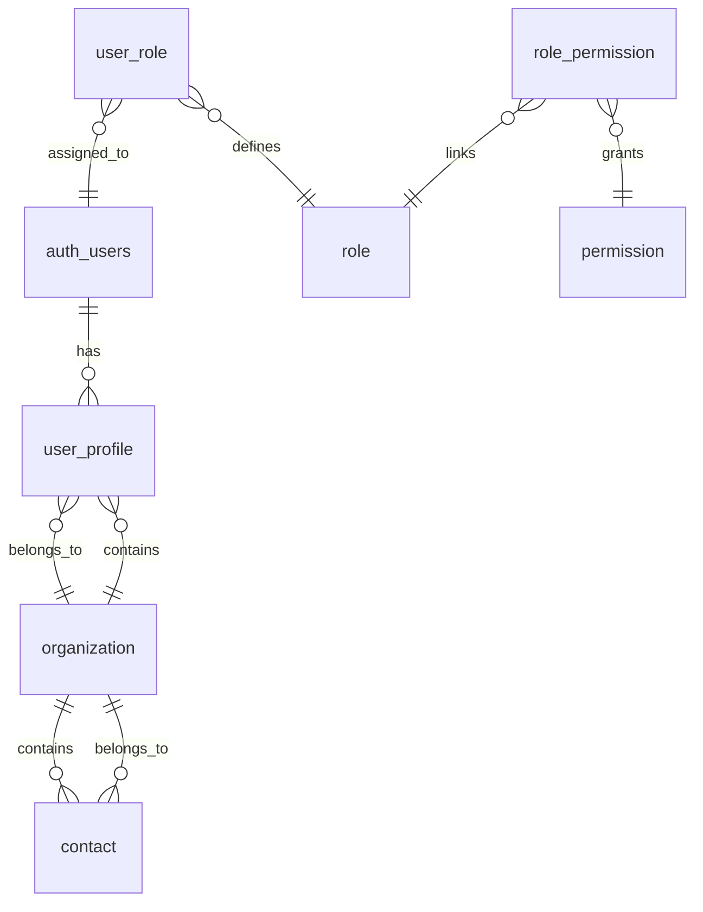

# 🧱 FOUNDATIONAL_PROMPT v2 — Reusable NestJS API Foundation (with Platform Schema)

## **Change Summary (v2 Updates)**

This version builds upon **FOUNDATIONAL_PROMPT v1**, maintaining all validated frameworks, structures, and configurations, while introducing a **Platform Schema Layer** to support modular, multi-tenant applications such as CRMs and compliance systems.

### **Key Additions**
- Added **Platform Schema Entities**: `user_profile`, `organization`, `role`, `permission`, `role_permission`, `user_role`, and `contact`.
- Updated **Customize Entities** section to include these models with relationship examples.
- Updated **AppModule** and **DatabaseModule** notes to register new entities.
- Added a **Mermaid ERD** to visualize relationships between authentication, organization, and permissions.
- Minor clarifications in `Add Project-Specific Modules` for modular structure integration.

---

# **Reusable NestJS API Foundation Prompt**

Create a modern, production-ready NestJS API with the following standardized foundation that can be reused across multiple projects.

## **Core Technology Stack**

**Framework & Runtime:**
- Node.js 20+ with TypeScript 5+
- NestJS 10+ with Fastify adapter
- Zod for runtime validation and type safety

**Database & Caching:**
- TypeORM 0.3+ with PostgreSQL
- Redis for caching, sessions, and queues
- Enhanced migration system with post-processors

**Performance & Security:**
- Fastify for high-performance HTTP
- JWT authentication with refresh tokens
- Rate limiting with Redis
- CORS and security headers
- Input sanitization and validation

**Developer Experience:**
- OpenAPI 3.1 with Swagger integration
- Comprehensive error handling
- Structured logging with Pino
- Health checks and metrics
- Docker containerization

---

## **Standard Project Structure**

```
src/
├── modules/
│   ├── auth/              # JWT authentication
│   ├── health/            # System monitoring
│   ├── platform/          # NEW: Organization, Roles, Permissions, Contacts
│   └── [custom-modules]/  # Project-specific modules
├── libs/
│   ├── core/              # Base classes & utilities
│   ├── database/          # TypeORM setup & entities
│   ├── interceptors/      # Request/response handling
│   ├── guards/            # Auth & permission guards
│   └── decorators/        # Custom decorators
├── database/
│   ├── migrations/        # TypeORM migrations
│   ├── entities/          # Database entities
│   └── scripts/           # Migration processors (kebab-case)
├── config/                # Environment configuration
└── main.ts                # NestJS + Fastify bootstrap
```

---

## **Customize Entities (Updated)**

Each entity extends the base foundation pattern and resides in `src/libs/database/entities/` or its corresponding module.

### **Core Foundation Entities**
These remain unchanged: `BaseEntity`, `User`, `Auth`, `RefreshToken`, etc.

### **New Platform Entities**
The following entities provide organizational and role-based capabilities usable across CRM, compliance, and multi-tenant platforms.

#### 🧩 user_profile.entity.ts
```typescript
import { Entity, Column, ManyToOne, JoinColumn, PrimaryColumn, CreateDateColumn, UpdateDateColumn } from 'typeorm';
import { Organization } from './organization.entity';

@Entity('user_profile')
export class UserProfile {
  @PrimaryColumn()
  id: string; // FK -> auth.users.id

  @ManyToOne(() => Organization, org => org.users)
  @JoinColumn({ name: 'organization_id' })
  organization: Organization;

  @Column({ nullable: true })
  display_name?: string;

  @Column({ nullable: true })
  timezone?: string;

  @Column({ nullable: true })
  avatar_url?: string;

  @CreateDateColumn()
  created_at: Date;

  @UpdateDateColumn()
  updated_at: Date;
}
```

#### 🧩 organization.entity.ts
```typescript
import { Entity, Column, ManyToOne, OneToMany, JoinColumn, PrimaryGeneratedColumn, CreateDateColumn } from 'typeorm';
import { UserProfile } from './user-profile.entity';
import { Contact } from './contact.entity';

@Entity('organization')
export class Organization {
  @PrimaryGeneratedColumn('uuid')
  id: string;

  @Column()
  name: string;

  @Column({ nullable: true })
  type?: string;

  @ManyToOne(() => Organization, org => org.children, { nullable: true })
  @JoinColumn({ name: 'parent_org_id' })
  parent_org?: Organization;

  @OneToMany(() => Organization, org => org.parent_org)
  children?: Organization[];

  @Column({ default: true })
  is_active: boolean;

  @CreateDateColumn()
  created_at: Date;

  @OneToMany(() => UserProfile, u => u.organization)
  users: UserProfile[];

  @OneToMany(() => Contact, c => c.organization)
  contacts: Contact[];
}
```

#### 🧩 role.entity.ts
```typescript
import { Entity, Column, PrimaryGeneratedColumn, OneToMany } from 'typeorm';
import { RolePermission } from './role-permission.entity';
import { UserRole } from './user-role.entity';

@Entity('role')
export class Role {
  @PrimaryGeneratedColumn('uuid')
  id: string;

  @Column()
  name: string;

  @Column({ nullable: true })
  description?: string;

  @Column({ type: 'enum', enum: ['global', 'organization', 'module'] })
  scope: 'global' | 'organization' | 'module';

  @OneToMany(() => RolePermission, rp => rp.role)
  rolePermissions: RolePermission[];

  @OneToMany(() => UserRole, ur => ur.role)
  userRoles: UserRole[];
}
```

#### 🧩 permission.entity.ts
```typescript
import { Entity, Column, PrimaryGeneratedColumn, OneToMany } from 'typeorm';
import { RolePermission } from './role-permission.entity';

@Entity('permission')
export class Permission {
  @PrimaryGeneratedColumn('uuid')
  id: string;

  @Column({ unique: true })
  code: string;

  @Column({ nullable: true })
  description?: string;

  @OneToMany(() => RolePermission, rp => rp.permission)
  rolePermissions: RolePermission[];
}
```

#### 🧩 role-permission.entity.ts
```typescript
import { Entity, ManyToOne, JoinColumn, PrimaryColumn } from 'typeorm';
import { Role } from './role.entity';
import { Permission } from './permission.entity';

@Entity('role_permission')
export class RolePermission {
  @PrimaryColumn()
  role_id: string;

  @PrimaryColumn()
  permission_id: string;

  @ManyToOne(() => Role, r => r.rolePermissions)
  @JoinColumn({ name: 'role_id' })
  role: Role;

  @ManyToOne(() => Permission, p => p.rolePermissions)
  @JoinColumn({ name: 'permission_id' })
  permission: Permission;
}
```

#### 🧩 user-role.entity.ts
```typescript
import { Entity, ManyToOne, JoinColumn, PrimaryColumn } from 'typeorm';
import { Role } from './role.entity';

@Entity('user_role')
export class UserRole {
  @PrimaryColumn()
  user_id: string; // FK -> auth.users.id

  @PrimaryColumn()
  role_id: string;

  @ManyToOne(() => Role, r => r.userRoles)
  @JoinColumn({ name: 'role_id' })
  role: Role;
}
```

#### 🧩 contact.entity.ts
```typescript
import { Entity, Column, ManyToOne, JoinColumn, PrimaryGeneratedColumn } from 'typeorm';
import { Organization } from './organization.entity';

@Entity('contact')
export class Contact {
  @PrimaryGeneratedColumn('uuid')
  id: string;

  @Column()
  first_name: string;

  @Column()
  last_name: string;

  @Column({ unique: true })
  email: string;

  @Column({ nullable: true })
  phone?: string;

  @Column({ nullable: true })
  title?: string;

  @ManyToOne(() => Organization, org => org.contacts)
  @JoinColumn({ name: 'organization_id' })
  organization: Organization;

  @Column({ nullable: true })
  user_id?: string; // FK -> auth.users.id
}
```

---

## **Platform ERD (Mermaid)**



---

## **Add Project-Specific Modules (Updated)**

In addition to existing feature modules (Auth, Health, etc.), include:

### `platform` Module
Contains services, controllers, and repositories for:
- Organization management
- Role & permission configuration
- Contact management
- User profiles linked to Supabase `auth.users`

**Registration Example (AppModule excerpt):**
```typescript
imports: [
  // existing imports
  TypeOrmModule.forFeature([
    UserProfile,
    Organization,
    Role,
    Permission,
    RolePermission,
    UserRole,
    Contact,
  ]),
]
```

---

_All other sections (package.json, environment, linting, testing, etc.) remain unchanged from v1._

---

## ✅ Summary

This **v2 foundational prompt** extends the proven NestJS foundation with a reusable **Platform Schema Layer**, enabling enterprise-ready identity, organization, and permission management out of the box.
