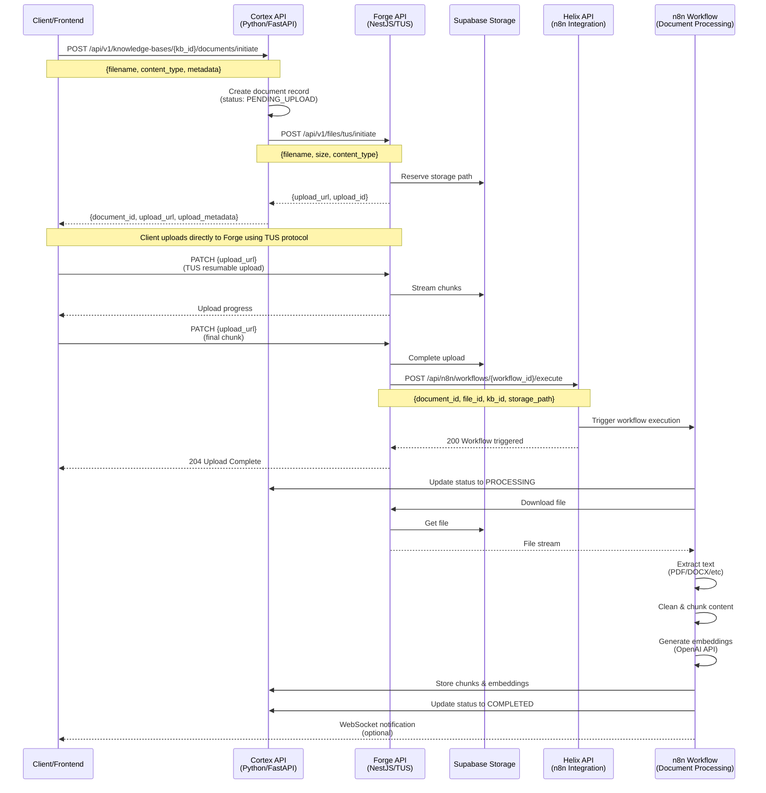
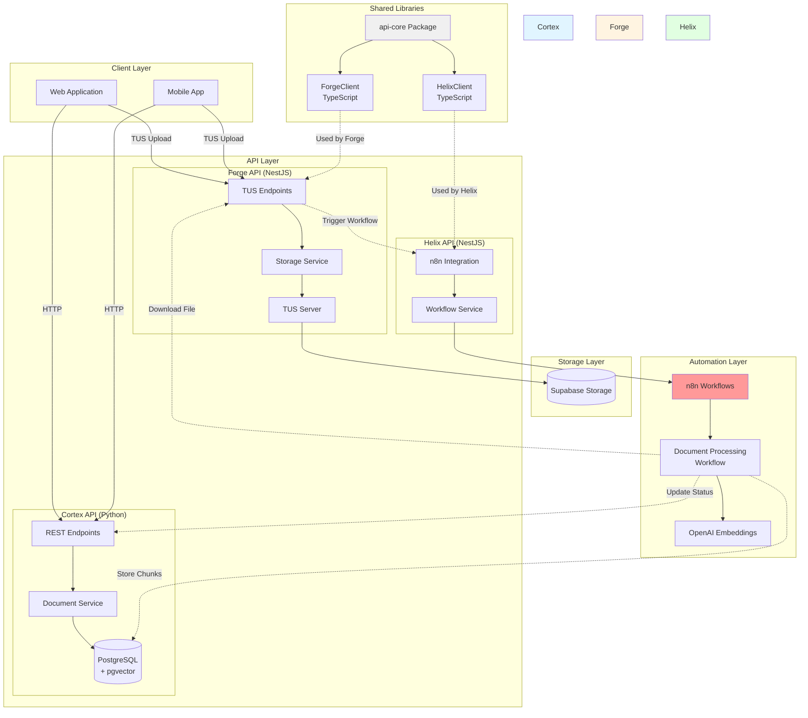
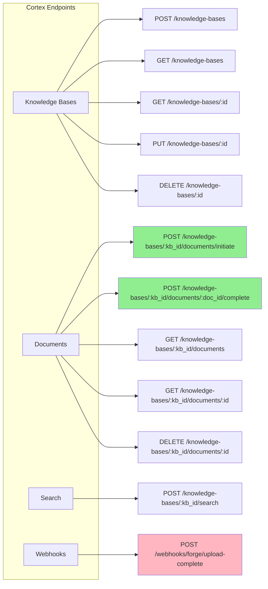
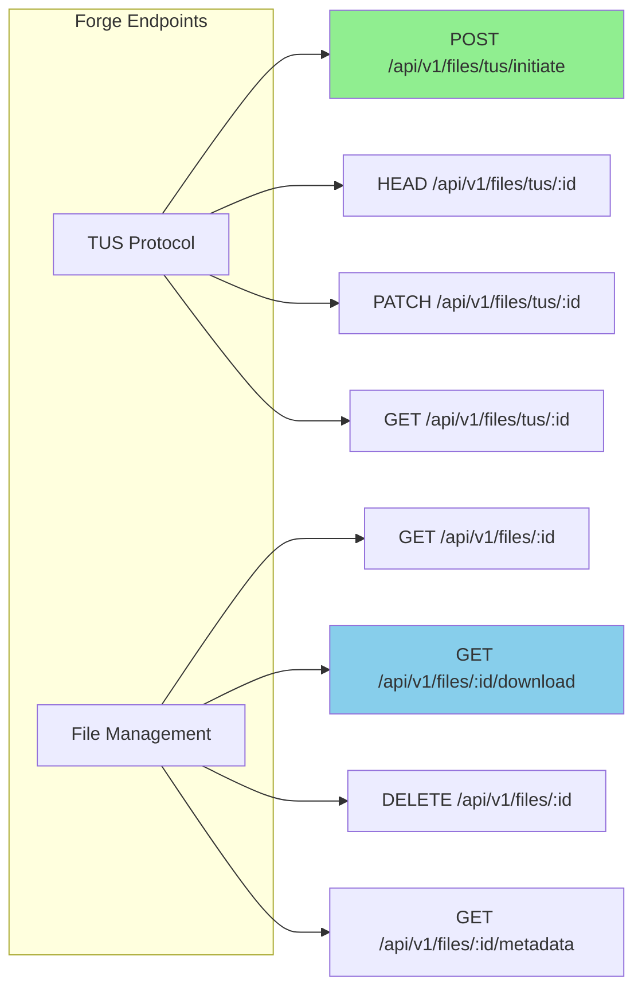
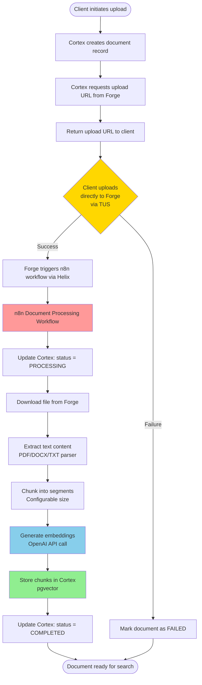
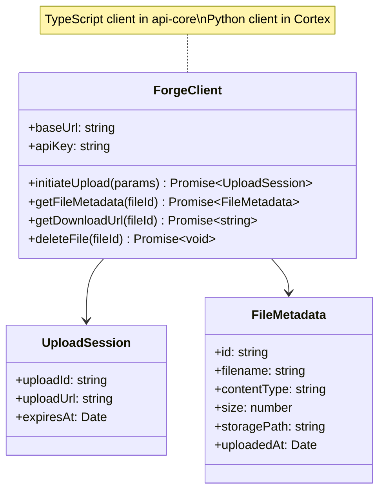
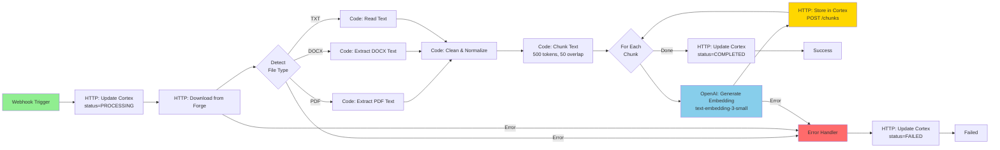

# Forge-Cortex Integration Architecture

## Document Upload Flow (with n8n Automation)



## Component Architecture (with n8n)



## API Endpoints

### Cortex API (Knowledge Base Management)



### Forge API (Storage & TUS)



## Data Flow (with n8n Automation)



## Client Library Structure



## Key Design Decisions

| Decision | Rationale |
|----------|-----------|
| **Direct Upload to Forge** | Better performance, leverages TUS resumable uploads, reduces Cortex load |
| **n8n for Processing** | Visual workflow builder, easier to modify processing logic, no custom worker code needed |
| **Helix as n8n Bridge** | Centralized n8n integration, reusable across all APIs, consistent workflow triggering |
| **Separate Client Libraries** | TypeScript for NestJS APIs (Forge + Helix clients), minimal HTTP wrappers |
| **Document Status States** | PENDING_UPLOAD → PROCESSING → COMPLETED/FAILED for clear lifecycle |
| **No Shared Database** | Maintains service boundaries, each service owns its data |
| **n8n Workflow Nodes** | HTTP Request (Cortex/Forge), Code (text extraction), OpenAI (embeddings) |

## Benefits of n8n Approach

✅ **Visual Workflow Management**: Non-developers can modify document processing logic
✅ **No Queue Infrastructure**: n8n handles execution, retries, and error handling
✅ **Flexible Processing**: Easy to add new document types, preprocessing steps
✅ **Monitoring Built-in**: n8n provides execution history and debugging
✅ **Reusable Patterns**: Same workflow approach for other automation needs
✅ **Error Recovery**: n8n's retry logic and error branches handle failures gracefully

## n8n Workflow Example

### Document Processing Workflow



### n8n Workflow Configuration

**Nodes:**
1. **Webhook Trigger** - Receives payload from Forge
2. **Update Status (Processing)** - HTTP Request to Cortex
3. **Download File** - HTTP Request to Forge
4. **Detect File Type** - Code node (JavaScript)
5. **Extract Text** - Code nodes for PDF/DOCX/TXT
6. **Clean Text** - Code node (remove special chars, normalize)
7. **Chunk Text** - Code node (split into chunks)
8. **Loop Chunks** - Split In Batches node
9. **Generate Embeddings** - OpenAI node
10. **Store Chunk** - HTTP Request to Cortex
11. **Update Status (Completed)** - HTTP Request to Cortex
12. **Error Handler** - Error Trigger + HTTP Request

**Environment Variables in n8n:**
- `CORTEX_API_URL`
- `FORGE_API_URL`
- `OPENAI_API_KEY`

## Environment Variables

### Cortex (.env)
```bash
# Forge Integration
FORGE_API_URL=http://localhost:4002
FORGE_API_KEY=<secret>

# No webhook secret needed - n8n handles callbacks
```

### Forge (.env)
```bash
# Helix Integration (for triggering n8n workflows)
HELIX_API_URL=http://localhost:4005
HELIX_API_KEY=<secret>
DOCUMENT_PROCESSING_WORKFLOW_ID=<n8n-workflow-id>

# Storage
SUPABASE_URL=<url>
SUPABASE_KEY=<key>
SUPABASE_BUCKET=documents
```

### Helix (.env)
```bash
# n8n Configuration
N8N_API_URL=http://localhost:5678
N8N_API_KEY=<secret>

# Service URLs (for n8n workflows to call back)
CORTEX_API_URL=http://localhost:8000
FORGE_API_URL=http://localhost:4002
```

### n8n Environment Variables
```bash
# Set in n8n workflow or global credentials
CORTEX_API_URL=http://localhost:8000
CORTEX_API_KEY=<secret>
FORGE_API_URL=http://localhost:4002
FORGE_API_KEY=<secret>
OPENAI_API_KEY=<secret>
```

## Development Approach & Sequence

### Recommended Approach: **Workflow-First Development**

Since Helix already exposes n8n endpoints, we should:
1. **Build the n8n workflow first** (using Helix API)
2. **Test it manually** with mock data
3. **Then add minimal API changes** to trigger it

### Why Workflow-First?

✅ **Validate the concept** - Prove document processing works before API changes
✅ **Iterate quickly** - n8n visual editor is faster than code changes
✅ **No deployment needed** - Test workflow without redeploying APIs
✅ **Parallel work** - Frontend/backend teams can work independently
✅ **Minimal risk** - Existing APIs unchanged until workflow is proven

---

## Development Sequence

### **Phase 1: n8n Workflow Development** (Priority: HIGH)
**Goal:** Build and test document processing workflow in n8n

**Steps:**
1. Access n8n instance via Helix
2. Create new workflow: "Document Processing Pipeline"
3. Add nodes:
   - Manual Trigger (for testing)
   - HTTP Request: Download file from Forge
   - Code: Detect file type
   - Code: Extract text (PDF/DOCX/TXT)
   - Code: Clean and chunk text
   - OpenAI: Generate embeddings
   - HTTP Request: Store chunks in Cortex
   - HTTP Request: Update document status
4. Test with sample documents
5. Add error handling branches
6. Configure retries and timeouts

**Deliverable:** Working n8n workflow that can process a document end-to-end

**Testing:**
```bash
# Manually trigger workflow via Helix API
curl -X POST http://localhost:4005/api/n8n/workflows/{workflow_id}/execute \
  -H "Content-Type: application/json" \
  -d '{
    "document_id": "test-doc-123",
    "file_id": "test-file-456",
    "kb_id": "test-kb-789",
    "storage_path": "path/to/test.pdf"
  }'
```

---

### **Phase 2: Cortex API Endpoints** (Priority: HIGH)
**Goal:** Add endpoints for n8n workflow to interact with Cortex

**Required Endpoints:**

1. **Update Document Status**
   ```python
   PATCH /api/v1/documents/{doc_id}/status
   Body: { "status": "processing" | "completed" | "failed", "error": "..." }
   ```

2. **Store Document Chunks**
   ```python
   POST /api/v1/documents/{doc_id}/chunks
   Body: {
     "chunks": [
       { "content": "...", "chunk_index": 0, "embedding": [...] }
     ]
   }
   ```

3. **Get Document Details** (may already exist)
   ```python
   GET /api/v1/documents/{doc_id}
   ```

**Deliverable:** Cortex endpoints that n8n can call

**Testing:**
```bash
# Test status update
curl -X PATCH http://localhost:8000/api/v1/documents/{doc_id}/status \
  -H "Content-Type: application/json" \
  -d '{"status": "processing"}'

# Test chunk storage
curl -X POST http://localhost:8000/api/v1/documents/{doc_id}/chunks \
  -H "Content-Type: application/json" \
  -d '{"chunks": [{"content": "test", "chunk_index": 0, "embedding": [...]}]}'
```

---

### **Phase 3: Client Libraries** (Priority: MEDIUM)
**Goal:** Create reusable TypeScript clients in api-core

**Files to Create:**
```
packages/api-core/src/clients/
├── forge-client.ts          # ForgeClient class
├── forge-client.types.ts    # TypeScript interfaces
├── forge-client.module.ts   # NestJS module
├── helix-client.ts          # HelixClient class
├── helix-client.types.ts    # TypeScript interfaces
└── helix-client.module.ts   # NestJS module
```

**ForgeClient Methods:**
- `initiateUpload(params)` → Upload session
- `getFileMetadata(fileId)` → File metadata
- `getDownloadUrl(fileId)` → Download URL
- `deleteFile(fileId)` → void

**HelixClient Methods:**
- `executeWorkflow(workflowId, payload)` → Execution response
- `getWorkflowStatus(executionId)` → Execution status
- `getWorkflow(workflowId)` → Workflow details

**Deliverable:** Reusable clients exported from api-core

---

### **Phase 4: Forge Integration** (Priority: MEDIUM)
**Goal:** Trigger n8n workflow after upload completes

**Changes to Forge:**

1. **Add Helix client dependency**
   ```typescript
   // forge/src/app.module.ts
   import { HelixClientModule } from '@asyml8/api-core';
   
   @Module({
     imports: [HelixClientModule, ...],
   })
   ```

2. **Trigger workflow after upload**
   ```typescript
   // forge/src/modules/tus/tus.service.ts
   async onUploadComplete(uploadId: string, metadata: any) {
     // Existing logic...
     
     // Trigger n8n workflow via Helix
     await this.helixClient.executeWorkflow(
       process.env.DOCUMENT_PROCESSING_WORKFLOW_ID,
       {
         document_id: metadata.document_id,
         file_id: uploadId,
         kb_id: metadata.kb_id,
         storage_path: storagePath,
       }
     );
   }
   ```

**Environment Variables:**
```bash
HELIX_API_URL=http://localhost:4005
HELIX_API_KEY=<secret>
DOCUMENT_PROCESSING_WORKFLOW_ID=<workflow-id-from-n8n>
```

**Deliverable:** Forge automatically triggers workflow on upload

---

### **Phase 5: Cortex Upload Flow** (Priority: LOW)
**Goal:** Update Cortex to support TUS upload initiation

**Changes to Cortex:**

1. **Add document status: PENDING_UPLOAD**
   ```python
   class DocumentStatus(str, enum.Enum):
       PENDING_UPLOAD = "pending_upload"
       PROCESSING = "processing"
       COMPLETED = "completed"
       FAILED = "failed"
   ```

2. **Add initiate-upload endpoint**
   ```python
   @router.post("/{kb_id}/documents/initiate-upload")
   async def initiate_upload(kb_id: UUID, doc: DocumentInitiateUpload):
       # Get upload URL from Forge
       upload_session = await forge_client.initiate_upload(...)
       
       # Create document record
       document = service.create_pending(...)
       
       return {
           "document_id": document.id,
           "upload_url": upload_session.upload_url,
           "upload_id": upload_session.upload_id
       }
   ```

**Deliverable:** Cortex can initiate uploads via Forge

---

### **Phase 6: Frontend Integration** (Priority: LOW)
**Goal:** Update frontend to use new upload flow

**Changes:**
1. Call Cortex initiate-upload endpoint
2. Use TUS client to upload directly to Forge
3. Poll document status or use WebSocket for updates

---

## Priority Summary

| Phase | Priority | Effort | Dependencies | Can Start Now? |
|-------|----------|--------|--------------|----------------|
| 1. n8n Workflow | **HIGH** | 2-3 days | Helix API (exists) | ✅ **YES** |
| 2. Cortex Endpoints | **HIGH** | 1-2 days | Phase 1 complete | ✅ **YES** (parallel) |
| 3. Client Libraries | MEDIUM | 1 day | None | ✅ **YES** (parallel) |
| 4. Forge Integration | MEDIUM | 1 day | Phase 1, 3 | ⏳ After Phase 1 |
| 5. Cortex Upload Flow | LOW | 1-2 days | Phase 3 | ⏳ After Phase 3 |
| 6. Frontend | LOW | 2-3 days | Phase 5 | ⏳ After Phase 5 |

---

## Recommended Start

### **Week 1: Prove the Concept**
- **Day 1-2:** Build n8n workflow (Phase 1)
- **Day 3:** Add Cortex endpoints (Phase 2)
- **Day 4:** Test end-to-end manually
- **Day 5:** Create client libraries (Phase 3)

### **Week 2: Integration**
- **Day 1:** Integrate Forge with Helix (Phase 4)
- **Day 2-3:** Update Cortex upload flow (Phase 5)
- **Day 4-5:** Frontend integration (Phase 6)

---

## Testing Strategy

### Manual Testing (Phase 1-2)
```bash
# 1. Upload a file to Forge manually
curl -X POST http://localhost:4002/api/v1/files/upload ...

# 2. Trigger n8n workflow via Helix
curl -X POST http://localhost:4005/api/n8n/workflows/{id}/execute \
  -d '{"file_id": "...", "document_id": "..."}'

# 3. Check n8n execution logs
curl http://localhost:4005/api/n8n/executions/{execution_id}

# 4. Verify chunks in Cortex
curl http://localhost:8000/api/v1/documents/{doc_id}
```

### Automated Testing (Phase 4+)
- Integration tests for Forge → Helix → n8n flow
- E2E tests for full upload → process → search flow

---

## Implementation Phases

### Phase 1: Client Libraries (api-core)
- Create `ForgeClient` in TypeScript
- Create `HelixClient` in TypeScript
- Export from api-core package

### Phase 2: Forge Integration
- Add endpoint to trigger Helix workflows after upload
- Pass document metadata to Helix

### Phase 3: Helix Integration
- Implement n8n workflow execution endpoints
- Add workflow status monitoring

### Phase 4: n8n Workflow
- Create document processing workflow in n8n
- Configure nodes for download, extract, chunk, embed
- Set up error handling and retries

### Phase 5: Cortex Endpoints
- Add endpoints for n8n to update document status
- Add endpoints for n8n to store chunks
- Update document schemas

### Phase 6: Testing & Monitoring
- End-to-end upload testing
- Monitor n8n execution logs
- Performance optimization

