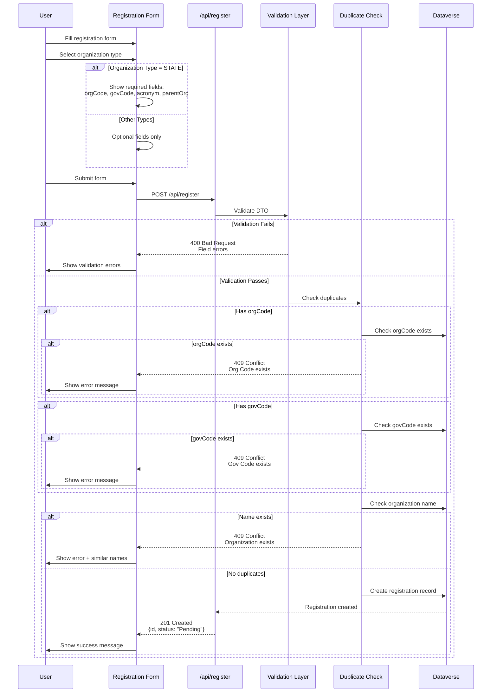
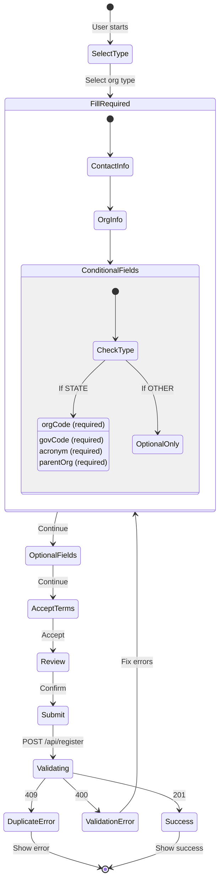
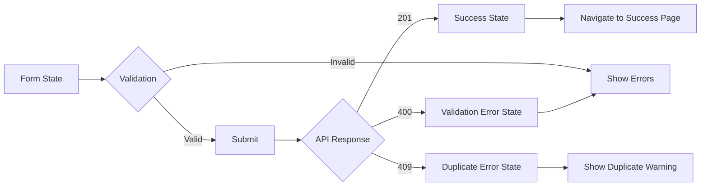

# Register API - Frontend Implementation Guide

## Overview

The Register API provides a public endpoint for organizations to submit registration requests. The API handles validation, duplicate detection, and creates pending registration records in Dataverse.

## API Endpoint

```
POST /api/register
```

**Authentication:** None required (public endpoint)

---

## Flow Diagram



---

## Request Structure

### Required Fields (All Types)

```typescript
{
  organizationType: 448150000 | 448150001 | 448150002 | 448150003,
  firstName: string,
  lastName: string,
  email: string,
  phone: string,
  businessPhone: string,
  organizationName: string,
  acceptedTerms: true
}
```

### Conditional Required Fields (STATE only)

When `organizationType === 448150000` (STATE):

```typescript
{
  orgCode: string,        // UID1 - Organization Code
  govCode: string,        // UID2 - Government Code
  acronym: string,        // Organization acronym
  parentOrganization: string
}
```

### Optional Fields (All Types)

```typescript
{
  county?: string,
  organizationPhone?: string,
  website?: string,
  fax?: string,
  addressLine1?: string,
  addressLine2?: string,
  city?: string,
  state?: string,
  zipCode?: string,
  mailingAddressLine1?: string,
  mailingAddressLine2?: string,
  mailingCity?: string,
  mailingState?: string,
  mailingZipCode?: string,
  mailingCounty?: string,
  acceptedPrivacyPolicy?: boolean
}
```

---

## Organization Types

```typescript
enum OrganizationType {
  STATE = 448150000,   // California State Agency
  COUNTY = 448150001,  // County Government
  LOCAL = 448150002,   // City/Municipality
  TRIBAL = 448150003   // Tribal Nation
}
```

---

## Response Structure

### Success (201 Created)

```typescript
{
  statusCode: 201,
  statusMessage: "Created",
  body: {
    id: string,              // Registration request ID
    firstName: string,
    lastName: string,
    email: string,
    status: "Pending"
  },
  message: "Registration request submitted successfully"
}
```

### Validation Error (400 Bad Request)

```typescript
{
  statusCode: 400,
  message: string[],         // Array of validation errors
  error: "Bad Request"
}
```

Example:
```json
{
  "statusCode": 400,
  "message": [
    "email must be an email",
    "organizationName should not be empty",
    "acceptedTerms must be a boolean value"
  ],
  "error": "Bad Request"
}
```

### Duplicate Error (409 Conflict)

```typescript
{
  statusCode: 409,
  message: string,           // Specific duplicate message
  error: "Conflict"
}
```

Examples:
```json
{
  "statusCode": 409,
  "message": "Organization with name \"Acme Corp\" is already registered. Please contact administrator.",
  "error": "Conflict"
}

{
  "statusCode": 409,
  "message": "Organization with Org Code ORG001 is already registered. Please contact administrator.",
  "error": "Conflict"
}
```

---

## Frontend Implementation

### Form State Management



### React Hook Example

```typescript
import { useMutation } from '@tanstack/react-query';
import type { RegisterOrganizationDto } from '@asyml8/api-types/generated';

export function useRegisterOrganization() {
  return useMutation({
    mutationFn: async (data: RegisterOrganizationDto) => {
      const response = await fetch('/api/register', {
        method: 'POST',
        headers: { 'Content-Type': 'application/json' },
        body: JSON.stringify(data),
      });
      
      if (!response.ok) {
        const error = await response.json();
        throw new Error(error.message);
      }
      
      return response.json();
    },
    onSuccess: (data) => {
      console.log('Registration submitted:', data.body.id);
    },
    onError: (error) => {
      console.error('Registration failed:', error);
    },
  });
}
```

### Form Validation

```typescript
import { OrganizationType } from '@asyml8/api-types/generated';

function validateForm(data: RegisterOrganizationDto): string[] {
  const errors: string[] = [];
  
  // Required fields
  if (!data.firstName) errors.push('First name is required');
  if (!data.lastName) errors.push('Last name is required');
  if (!data.email) errors.push('Email is required');
  if (!data.phone) errors.push('Phone is required');
  if (!data.businessPhone) errors.push('Business phone is required');
  if (!data.organizationName) errors.push('Organization name is required');
  if (!data.acceptedTerms) errors.push('You must accept the terms');
  
  // Conditional validation for STATE entities
  if (data.organizationType === OrganizationType.STATE) {
    if (!data.orgCode) errors.push('Org Code is required for State entities');
    if (!data.govCode) errors.push('Gov Code is required for State entities');
    if (!data.acronym) errors.push('Acronym is required for State entities');
    if (!data.parentOrganization) errors.push('Parent Organization is required for State entities');
  }
  
  return errors;
}
```

---

## Duplicate Detection

### Similar Names Endpoint

```
GET /api/accounts/similar?name={searchTerm}
```

**Use case:** Show user if similar organizations exist before submitting

**Example:**
```typescript
async function checkSimilarNames(name: string) {
  if (name.length < 3) return [];
  
  const response = await fetch(`/api/accounts/similar?name=${encodeURIComponent(name)}`);
  const data = await response.json();
  
  return data.body; // Array of similar organizations
}
```

**When to call:**
- `onBlur` of organization name field
- After user types 3+ characters
- Before form submission

---

## Form Flow

```mermaid
flowchart TD
    Start([User visits registration]) --> SelectType[Select Organization Type]
    
    SelectType --> ShowFields{Organization Type?}
    
    ShowFields -->|STATE| StateFields[Show STATE required fields:<br/>- orgCode<br/>- govCode<br/>- acronym<br/>- parentOrganization]
    ShowFields -->|COUNTY/LOCAL/TRIBAL| BasicFields[Show basic fields only]
    
    StateFields --> ContactInfo[Fill Contact Information:<br/>- firstName<br/>- lastName<br/>- email<br/>- phone<br/>- businessPhone]
    BasicFields --> ContactInfo
    
    ContactInfo --> OrgInfo[Fill Organization Info:<br/>- organizationName<br/>- Optional: address, website, etc.]
    
    OrgInfo --> CheckSimilar{Check similar names}
    CheckSimilar -->|Similar found| ShowWarning[Show warning:<br/>"Similar organizations exist"]
    CheckSimilar -->|None found| Terms
    ShowWarning --> UserDecision{User continues?}
    UserDecision -->|Yes| Terms[Accept Terms]
    UserDecision -->|No| OrgInfo
    
    Terms --> Review[Review & Submit]
    Review --> Submit[POST /api/register]
    
    Submit --> Response{Response?}
    
    Response -->|201 Created| Success[Show success message:<br/>"Registration submitted"<br/>Status: Pending]
    Response -->|400 Bad Request| ValidationErrors[Show field errors]
    Response -->|409 Conflict| DuplicateError[Show duplicate error:<br/>Name/Code already exists]
    
    ValidationErrors --> ContactInfo
    DuplicateError --> End([Registration failed])
    Success --> End
    
    style Success fill:#90EE90
    style DuplicateError fill:#FFB6C1
    style ValidationErrors fill:#FFD700
```

---

## UI Components Needed

### 1. Organization Type Selector

```typescript
<RadioGroup value={organizationType} onChange={setOrganizationType}>
  <Radio value={448150000}>California State Agency</Radio>
  <Radio value={448150001}>County Government</Radio>
  <Radio value={448150002}>City/Municipality</Radio>
  <Radio value={448150003}>Tribal Nation</Radio>
</RadioGroup>
```

### 2. Conditional Fields

```typescript
{organizationType === OrganizationType.STATE && (
  <>
    <TextField label="Org Code (UID1)" required />
    <TextField label="Gov Code (UID2)" required />
    <TextField label="Acronym" required />
    <TextField label="Parent Organization" required />
  </>
)}
```

### 3. Similar Names Warning

```typescript
{similarOrgs.length > 0 && (
  <Alert severity="warning">
    Similar organizations found:
    <ul>
      {similarOrgs.map(org => (
        <li key={org.accountid}>{org.name}</li>
      ))}
    </ul>
    Are you sure you want to continue?
  </Alert>
)}
```

### 4. Terms Acceptance

```typescript
<Checkbox 
  checked={acceptedTerms} 
  onChange={(e) => setAcceptedTerms(e.target.checked)}
  required
>
  I accept the terms and conditions
</Checkbox>
```

---

## Error Handling

```typescript
try {
  const result = await registerMutation.mutateAsync(formData);
  
  // Success
  navigate('/registration-success', { 
    state: { registrationId: result.body.id } 
  });
  
} catch (error: any) {
  if (error.response?.status === 400) {
    // Validation errors
    setFieldErrors(error.response.data.message);
  } else if (error.response?.status === 409) {
    // Duplicate
    setGlobalError(error.response.data.message);
    // Optionally fetch similar names
    const similar = await checkSimilarNames(formData.organizationName);
    setSimilarOrgs(similar);
  } else {
    // Unknown error
    setGlobalError('An unexpected error occurred. Please try again.');
  }
}
```

---

## Validation Rules

### Client-Side (Before Submit)

- ✅ All required fields filled
- ✅ Email format valid
- ✅ Phone format valid (optional)
- ✅ Terms accepted
- ✅ STATE type has conditional fields

### Server-Side (API)

- ✅ DTO validation (class-validator)
- ✅ Organization type enum valid
- ✅ Conditional validation (STATE fields)
- ✅ Duplicate name check
- ✅ Duplicate orgCode check (if provided)
- ✅ Duplicate govCode check (if provided)

---

## Testing Checklist

### Happy Path
- [ ] Register LOCAL organization (minimal fields)
- [ ] Register COUNTY organization (with optional fields)
- [ ] Register STATE organization (all required fields)
- [ ] Register TRIBAL organization

### Validation
- [ ] Submit without required fields → 400 error
- [ ] Submit with invalid email → 400 error
- [ ] Submit STATE without orgCode → 400 error
- [ ] Submit without accepting terms → 400 error

### Duplicates
- [ ] Submit duplicate organization name → 409 error
- [ ] Submit duplicate orgCode → 409 error
- [ ] Submit duplicate govCode → 409 error
- [ ] Similar names warning shows correctly

### UX
- [ ] Conditional fields show/hide based on type
- [ ] Similar names check on blur
- [ ] Error messages are clear
- [ ] Success message shows registration ID
- [ ] Form resets after success

---

## Example Request

### STATE Organization

```json
{
  "organizationType": 448150000,
  "firstName": "Jane",
  "lastName": "Smith",
  "email": "jane.smith@state.ca.gov",
  "phone": "(916) 445-1000",
  "businessPhone": "(916) 445-1000 ext 100",
  "organizationName": "California Department of Example",
  "orgCode": "ORG123",
  "govCode": "GOV456",
  "acronym": "CDEX",
  "parentOrganization": "State of California",
  "county": "Sacramento",
  "addressLine1": "1515 S Street",
  "city": "Sacramento",
  "state": "CA",
  "zipCode": "95811",
  "acceptedTerms": true
}
```

### LOCAL Organization

```json
{
  "organizationType": 448150002,
  "firstName": "John",
  "lastName": "Doe",
  "email": "john.doe@city.ca.gov",
  "phone": "(916) 808-5000",
  "businessPhone": "(916) 808-5000 ext 200",
  "organizationName": "City of Example",
  "county": "Sacramento",
  "acceptedTerms": true
}
```

---

## Generated Types Usage

```typescript
import type { 
  RegisterOrganizationDto,
  OrganizationType,
  EntityResponse 
} from '@asyml8/api-types/generated';

// Form state
const [formData, setFormData] = useState<RegisterOrganizationDto>({
  organizationType: OrganizationType.LOCAL,
  firstName: '',
  lastName: '',
  email: '',
  phone: '',
  businessPhone: '',
  organizationName: '',
  acceptedTerms: false,
});

// API call
async function submitRegistration(data: RegisterOrganizationDto): Promise<EntityResponse> {
  const response = await fetch('/api/register', {
    method: 'POST',
    headers: { 'Content-Type': 'application/json' },
    body: JSON.stringify(data),
  });
  
  if (!response.ok) {
    throw await response.json();
  }
  
  return response.json();
}
```

---

## State Management



---

## Next Steps for Frontend

1. **Create registration form component**
   - Organization type selector
   - Conditional field rendering
   - Form validation

2. **Implement API integration**
   - Use generated types
   - React Query mutation
   - Error handling

3. **Add similar names check**
   - Debounced API call
   - Warning UI component

4. **Success/Error states**
   - Success page with registration ID
   - Error messages
   - Retry logic

5. **Testing**
   - Unit tests for validation
   - Integration tests with mock API
   - E2E tests with real API
